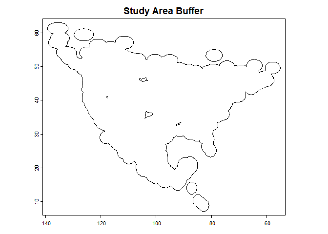
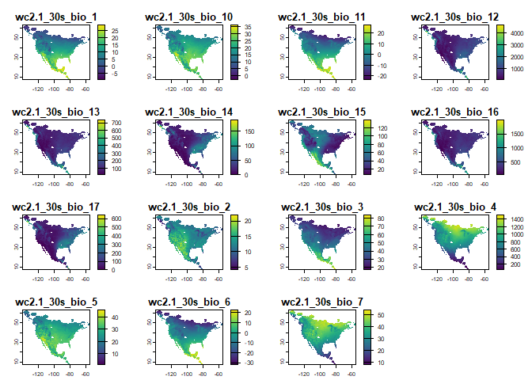
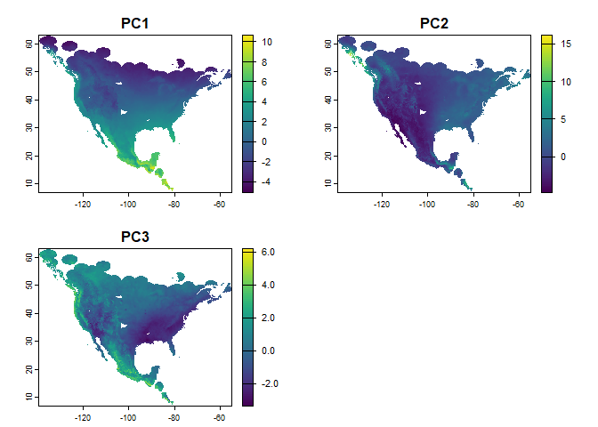
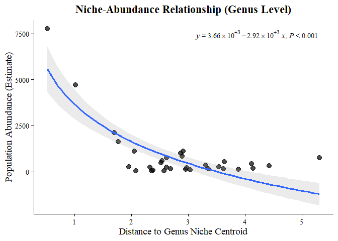
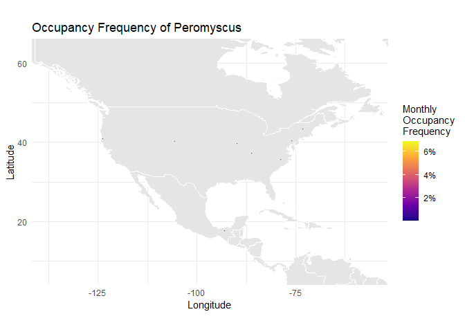
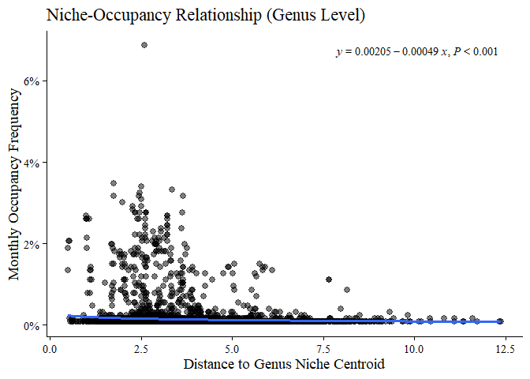
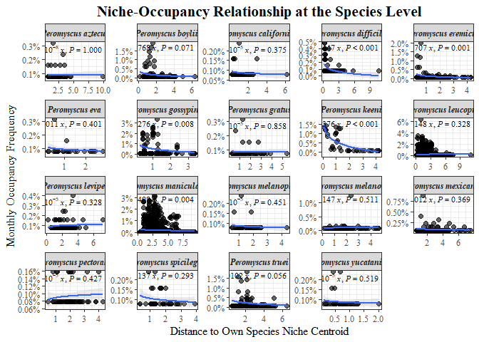

1.  Load Libraries This chunk loads all the necessary R packages for the
    analysis. Each package serves a specific purpose, from spatial data
    manipulation to data visualization.

``` r
# --- Core Data Manipulation & Spatial ---
library(tidyverse) # A suite of packages for data manipulation and visualization (ggplot2, dplyr, etc.)
#> ── Attaching core tidyverse packages ──────────────────────── tidyverse 2.0.0 ──
#> ✔ dplyr     1.1.4     ✔ readr     2.1.5
#> ✔ forcats   1.0.1     ✔ stringr   1.5.2
#> ✔ ggplot2   4.0.0     ✔ tibble    3.3.0
#> ✔ lubridate 1.9.4     ✔ tidyr     1.3.1
#> ✔ purrr     1.1.0     
#> ── Conflicts ────────────────────────────────────────── tidyverse_conflicts() ──
#> ✖ dplyr::filter() masks stats::filter()
#> ✖ dplyr::lag()    masks stats::lag()
#> ℹ Use the conflicted package (<http://conflicted.r-lib.org/>) to force all conflicts to become errors
library(terra)     # Modern package for handling raster and vector spatial data
#> terra 1.8.70
#> 
#> Attaching package: 'terra'
#> 
#> The following object is masked from 'package:tidyr':
#> 
#>     extract
library(sf)        # Modern package for handling vector spatial data (features)
#> Linking to GEOS 3.13.1, GDAL 3.11.0, PROJ 9.6.0; sf_use_s2() is TRUE

# --- Niche & Species Distribution Modeling ---
library(usdm)      # Tools for uncertainty analysis in species distribution models (e.g., VIF)

# --- Visualization ---
library(plotly)         # For creating interactive 3D plots
#> 
#> Attaching package: 'plotly'
#> 
#> The following object is masked from 'package:ggplot2':
#> 
#>     last_plot
#> 
#> The following object is masked from 'package:stats':
#> 
#>     filter
#> 
#> The following object is masked from 'package:graphics':
#> 
#>     layout
library(RColorBrewer)   # Provides color palettes for plotting
library(ggpmisc)        # Extends ggplot2 with tools for adding stats to plots
#> Loading required package: ggpp
#> Registered S3 methods overwritten by 'ggpp':
#>   method                  from   
#>   heightDetails.titleGrob ggplot2
#>   widthDetails.titleGrob  ggplot2
#> 
#> Attaching package: 'ggpp'
#> 
#> The following object is masked from 'package:ggplot2':
#> 
#>     annotate
library(maps)           # Basic map datasets
#> 
#> Attaching package: 'maps'
#> 
#> The following object is masked from 'package:purrr':
#> 
#>     map
library(rnaturalearth)  # Higher-quality map datasets

# --- Utility & Other ---
library(geodata)   # For downloading climate and other geographic data
library(lubridate) # For easier handling of dates and times
```

2.  Load and Prepare Occurrence Data Here, we load the Peromyscus
    occurrence records, remove any duplicate points based on
    coordinates, and convert the dataset into a terra spatial vector
    object for use in spatial analyses.

``` r
# Read the occurrence data from a CSV file
# The 'distinct' function removes duplicate rows based on longitude and latitude,
# keeping the first record encountered (.keep_all = TRUE).
peromyscus_occ <- read_csv("data/Peromyscus_occurrence.csv") %>%
  distinct(decimalLongitude, decimalLatitude, .keep_all = TRUE)
#> Rows: 76751 Columns: 8
#> ── Column specification ────────────────────────────────────────────────────────
#> Delimiter: ","
#> chr (3): genus, species, eventDate
#> dbl (5): decimalLongitude, decimalLatitude, month, day, year
#> 
#> ℹ Use `spec()` to retrieve the full column specification for this data.
#> ℹ Specify the column types or set `show_col_types = FALSE` to quiet this message.

# Convert the data frame into a SpatVector object (from the 'terra' package).
# This is necessary for spatial operations like buffering and extracting raster values.
peromyscus_vec <- vect(peromyscus_occ,
                     geom = c("decimalLongitude", "decimalLatitude"),
                     crs = "epsg:4326",  # Set the coordinate reference system to WGS84
                     keepgeom = FALSE)
```

3.  Define Study Area and Prepare Environmental Data (PCA) This section
    defines the study area by creating a buffer around the occurrence
    points. It then downloads global climate data, clips it to the study
    area, and performs a Principal Component Analysis (PCA) to reduce
    the dimensionality of the environmental variables.

``` r
# --- Step 3a: Define the Study Area ---
# Create a 200km (200,000 meters) buffer around each occurrence point.
# This helps define the accessible area 'M' for the genus.
peromyscus_buffer <- buffer(peromyscus_vec, width = 200000)

# Aggregate the individual buffers into a single polygon representing the total study area.
peromyscus_buffer <- aggregate(peromyscus_buffer)
plot(peromyscus_buffer, main = "Study Area Buffer")
```



``` r

# --- Step 3b: Download and Process Bioclimatic Data ---
# Download WorldClim bioclimatic variables at 30 arc-second resolution.
# We exclude BIO8, BIO9, BIO18, and BIO19 as they often deal with quarter-based
# extremes and can be less stable or relevant than annual/monthly variables.
bioclim_full <- worldclim_global(path = tempdir(), res = 0.5, var = "bio")
bioclim_full <- bioclim_full[[c(1:7, 10:17)]] # Select desired layers

# Crop the global raster layers to the extent of our study area buffer.
# The 'mask = TRUE' argument ensures that values outside the polygon are set to NA.
bioclim_cropped <- terra::crop(bioclim_full, peromyscus_buffer, mask = TRUE)
#> |---------|---------|---------|---------|=========================================                                          
plot(bioclim_cropped)
```



``` r
# --- Step 3c: Perform Principal Component Analysis (PCA) ---
# PCA is used to reduce the 15 correlated bioclimatic variables into a few
# uncorrelated principal components (PCs) that explain most of the environmental variance.
# We use na.omit to handle cells with no- data within the cropped extent.
pca <- prcomp(bioclim_cropped, scale. = TRUE, center = TRUE)

# Project the PCA model back onto the geographic space to create PC raster layers.
# We only use the first 3 PCs, which typically capture the majority of the variance.
pca_raster <- predict(bioclim_cropped, pca, index = 1:3)
#> |---------|---------|---------|---------|=========================================                                          
names(pca_raster) <- paste0("PC", 1:3) # Rename layers for clarity
plot(pca_raster)
```



4.  Construct Environmental Niche Ellipsoids In this chunk, we define
    the environmental niche for the entire genus and for each individual
    species using 3D ellipsoids. The ellipsoids are constructed in the
    environmental space defined by the first three PCs.

``` r
# --- Step 4a: Extract PC Values for Occurrence Points ---
# Extract the PC values from the raster layers at each occurrence location.
bioclim_values <- terra::extract(pca_raster, peromyscus_vec)[, -1] # Drop the ID column

# Combine the original occurrence data with the extracted PC values.
# na.omit() removes any points that fell outside the raster coverage.
full_data <- cbind(as.data.frame(peromyscus_vec), bioclim_values) %>%
  na.omit()

# --- Step 4b: Function to Generate Ellipsoid Points ---
# This function calculates the 3D coordinates of an ellipsoid surface
# based on a centroid (mean) and a covariance matrix.
generate_ellipsoid <- function(center,
                             covariance,
                             confidence_level = 0.95,
                             n_points = 1000) {

  df <- length(center) # Degrees of freedom (2 for 2D, 3 for 3D)

  if (df < 2 || df > 3) {
    stop("This function only supports 2D or 3D ellipsoids (length of center must be 2 or 3).")
  }
  
  if (!all(dim(covariance) == c(df, df))) {
    stop("Dimensions of 'covariance' matrix must match the length of 'center'.")
  }

  # Chi-squared quantile defines the radius/size of the ellipsoid
  chi_sq_quantile <- qchisq(confidence_level, df)

  # Eigen decomposition finds the orientation and length of the ellipsoid axes
  eig <- eigen(covariance)
  eigenvalues <- eig$values
  eigenvectors <- eig$vectors

  # Scale a unit sphere/circle to the shape of the ellipsoid
  scaling_factors <- sqrt(chi_sq_quantile * eigenvalues)

  # --- Point Generation ---
  if (df == 2) {
    # 2D (Circle)
    n_seg <- n_points
    u <- seq(0, 2 * pi, length.out = n_seg)
    unit_points <- cbind(cos(u), sin(u))
    colnames(unit_points) <- c("x", "y")
    
  } else if (df == 3) {
    # 3D (Sphere) - Use outer() for efficient grid generation
    n_seg <- round(sqrt(n_points))
    u <- seq(0, 2 * pi, length.out = n_seg)
    v <- seq(0, pi, length.out = n_seg)
    
    # Create 3D points using matrix operations
    # %o% is the outer product operator
    x <- cos(u) %o% sin(v)
    y <- sin(u) %o% sin(v)
    z <- rep(1, n_seg) %o% cos(v) # z only depends on v
    
    # Combine into an (n_seg^2) x 3 matrix
    unit_points <- cbind(as.vector(x), as.vector(y), as.vector(z))
    colnames(unit_points) <- c("x", "y", "z")
  }

  # --- Transformation ---
  # Apply scaling, rotation, and translation
  # (N x df) %*% (df x df) %*% (df x df)
  # Note: The original math was correct!
  # x = center + U * diag(scaling_factors) * unit_sphere_point
  # In R (with row vectors): x_rows = unit_points %*% diag(scaling_factors) %*% t(U) + center
  
  ellipsoid_points <- unit_points %*% diag(scaling_factors) %*% t(eigenvectors)
  
  # Use sweep() to add the center vector to each row
  ellipsoid_points <- sweep(ellipsoid_points, 2, center, "+")
  
  return(as.data.frame(ellipsoid_points))
}

# --- Step 4c: Genus-level "Fundamental Niche" Ellipsoid ---
# Calculate the centroid and covariance for all Peromyscus occurrences
genus_pcs <- full_data %>% dplyr::select(PC1, PC2, PC3)
genus_centroid <- colMeans(genus_pcs)
genus_cov <- cov(genus_pcs)
genus_ellipsoid <- generate_ellipsoid(genus_centroid, genus_cov)
colnames(genus_ellipsoid) <- c("PC1", "PC2", "PC3")

# --- Step 4d: Species-specific Ellipsoids ---
species_list <- unique(full_data$species)
ellipsoid_list <- list() # To store ellipsoid points
centroid_list <- list()   # To store species centroids

for (sp in species_list) {
  species_subset <- full_data %>%
    filter(species == sp) %>%
    dplyr::select(PC1, PC2, PC3)

  # A species needs at least 4 points for a 3D covariance matrix.
  # We use a higher threshold for stability.
  if (nrow(species_subset) > 6) {
    center <- colMeans(species_subset)
    covariance <- cov(species_subset)
    
    # Store the calculated centroid
    centroid_list[[sp]] <- as.data.frame(t(center)) %>%
      mutate(species = sp)
      
    # Generate and store the ellipsoid
    ellipsoid_df <- generate_ellipsoid(center, covariance)
    colnames(ellipsoid_df) <- c("PC1", "PC2", "PC3")
    ellipsoid_list[[sp]] <- ellipsoid_df
  } else {
    cat(paste("Skipping species '", sp, "' due to insufficient data (<= 6 points).\n", sep=""))
  }
}
#> Skipping species 'Peromyscus crinitus' due to insufficient data (<= 6 points).
#> Skipping species 'Peromyscus caniceps' due to insufficient data (<= 6 points).
#> Skipping species 'Peromyscus polius' due to insufficient data (<= 6 points).
#> Skipping species 'Peromyscus gymnotis' due to insufficient data (<= 6 points).
#> Skipping species 'Peromyscus ochraventer' due to insufficient data (<= 6 points).
#> Skipping species 'Peromyscus nasutus' due to insufficient data (<= 6 points).
#> Skipping species 'Peromyscus interparietalis' due to insufficient data (<= 6 points).
#> Skipping species 'Peromyscus melanurus' due to insufficient data (<= 6 points).
#> Skipping species 'Peromyscus stephani' due to insufficient data (<= 6 points).
#> Skipping species 'Peromyscus winkelmanni' due to insufficient data (<= 6 points).
#> Skipping species 'Peromyscus hooperi' due to insufficient data (<= 6 points).
#> Skipping species 'Peromyscus sejugis' due to insufficient data (<= 6 points).
#> Skipping species 'Peromyscus pseudocrinitus' due to insufficient data (<= 6 points).
#> Skipping species 'Peromyscus slevini' due to insufficient data (<= 6 points).

# Combine the list of individual centroids into a single data frame
all_centroids <- bind_rows(centroid_list)
```

5.  Process Population Abundance Data We now load a separate dataset
    containing population abundance estimates. We’ll extract the PC
    scores for these locations to place them within our defined
    environmental niche space.

``` r
# Load population data
pop_data <- read.csv("data/Peromyscus_population.csv")

# Clean data: select relevant columns and remove rows with missing values
pop_sites <- pop_data %>%
  dplyr::select(decimalLongitude, decimalLatitude, estimate) %>%
  na.omit()

# Extract the PC scores for each population site coordinate
site_coords <- pop_sites %>% dplyr::select(decimalLongitude, decimalLatitude)
site_pc_scores <- terra::extract(pca_raster, site_coords)[, -1] # Drop ID column

# Combine the population estimates with their corresponding PC scores
pop_total_datsite <- cbind(pop_sites, site_pc_scores) %>%
  na.omit()
```

6.  Visualize Niches and Abundance in 3D Space This chunk creates an
    interactive 3D plot to visualize the niche relationships. It shows:

- The overall environmental space occupied by the genus (gray points).
- The genus-level niche ellipsoid (large blue outline).
- Individual species niche ellipsoids (colored outlines).
- The niche centroid for each species and the genus.
- Population abundance data, where marker size represents abundance (red
  points).

``` r
# --- Step 6a: Create a Color Palette for Species ---
# Create a palette-generating function
get_palette <- colorRampPalette(brewer.pal(12, "Paired"))
# Generate the exact number of colors needed for the species
num_species <- length(ellipsoid_list)
species_colors <- get_palette(num_species)
# Create a named map to assign a consistent color to each species
color_map <- setNames(species_colors, names(ellipsoid_list))

# --- Step 6b: Build the 3D Plot Layer by Layer ---
fig <- plot_ly()

# Layer 1: All occurrence points as a grey background
fig <- fig %>% add_trace(
  data = full_data,
  x = ~PC1, y = ~PC2, z = ~PC3,
  type = 'scatter3d',
  mode = 'markers',
  marker = list(size = 1.5, color = 'grey'),
  opacity = 0.8,
            connectgaps = TRUE,
  name = 'All Occurrences'
)

# Layer 2: The main genus-level ellipsoid
fig <- fig %>% add_trace(
  data = genus_ellipsoid,
  x = ~PC1, y = ~PC2, z = ~PC3,
  type = 'scatter3d', 
  mode = 'lines',
  line = list(width = 5, color = "darkblue", shape = "spline"),
  connectgaps = TRUE,
  opacity = 0.3,
  name = 'Genus Niche (<i>Peromyscus</i>)'
)

# Layer 3: Each species-specific ellipsoid
for (sp in names(ellipsoid_list)) {
  fig <- fig %>% add_trace(
    data = ellipsoid_list[[sp]],
    x = ~PC1, y = ~PC2, z = ~PC3,
    type = 'scatter3d', 
    mode = 'lines',
    line = list(size = 1, color = color_map[[sp]], shape = "spline"),
    opacity = 0.2,
    name = paste("<i>", sp, "</i>"),
    showlegend = TRUE
  )
}

# Layer 4: Species centroids
fig <- fig %>% 
  add_trace(data = all_centroids, 
            x = ~PC1, y = ~PC2, z = ~PC3,
            type = 'scatter3d', 
            mode = 'markers',
            marker = list(size = 5, color = ~color_map,
                          line = list(color = 'black', width = 5)),
            name = 'Species Centroids', 
            showlegend = TRUE)

# Layer 5: The overall genus centroid
fig <- fig %>% 
  add_trace(x = ~genus_centroid[1], y = ~genus_centroid[2], z = ~genus_centroid[3],
            type = 'scatter3d', 
            mode = 'markers',
            marker = list(size = 8, color = 'black', symbol = 'diamond'),
            name = 'Genus Centroid', showlegend = TRUE)

# Layer 6: Population size markers
fig <- fig %>% 
  add_trace(data = pop_total_datsite, 
            x = ~PC1, y = ~PC2, z = ~PC3,
            type = 'scatter3d',
            mode = 'markers',
            marker = list(size = ~sqrt(estimate)/4,
                          color = 'red',
                          opacity = 0.8),
            name = 'Population Density', showlegend = TRUE)

# --- Step 6c: Customize the Plot Layout ---
fig <- fig %>% layout(
  scene = list(
    xaxis = list(title = "PC1"),
    yaxis = list(title = "PC2"),
    zaxis = list(title = "PC3")
  ),
  legend = list(title = list(text = '<b>Legend</b>'))
)

# Display the interactive plot
# fig %>% layout(
#  font = list(
#    family = "Times New Roman",
#    size = 12)
#  )
```

7.  Test Niche-Center Relationship (Genus Level) Here, we test the
    “niche centrality” hypothesis at the genus level: are populations
    more abundant in environments that are closer to the center of the
    genus’s overall environmental niche? We calculate the Euclidean
    distance from each population site to the genus centroid and plot it
    against abundance.

``` r
# --- Step 7a: Calculate Distances to Genus Centroid ---
# Helper function for 3D Euclidean distance
euc_dist <- function(p1, p2) sqrt(sum((p1 - p2)^2))

# Calculate distance for each population site to the GENUS centroid
pop_total_datsite$dist_to_genus_centroid <- apply(
  pop_total_datsite[, c("PC1", "PC2", "PC3")], 1,
  function(site_coords) euc_dist(site_coords, genus_centroid)
)

# --- Step 7b: Create the Plot ---
plot_genus_abundance <- ggplot(pop_total_datsite, 
                               aes(x = dist_to_genus_centroid, y = estimate)) +
  geom_point(size = 3, alpha = 0.7) +
  # A log-linear model is often suitable for ecological relationships
  stat_poly_line(formula = y ~ log(x), 
                 se = TRUE, 
                 alpha = 0.2) +
  stat_poly_eq(aes(label = paste(after_stat(eq.label), 
                                 after_stat(p.value.label), 
                                 sep = "*\", \"*")),
               formula = y ~ log(x),
               label.y = "top", 
               label.x = "right", 
               size = 4, 
               parse = TRUE,
               family = "serif"
  ) +
  labs(
    x = "Distance to Genus Niche Centroid",
    y = "Population Abundance (Estimate)",
    title = "Niche-Abundance Relationship (Genus Level)"
  ) +
  theme_classic(base_size = 14) +
  theme(
    text = element_text(family = "serif"),
    plot.title = element_text(face = "bold", hjust = 0.5)
  )

plot_genus_abundance
```



8.  Calculate Temporal Occupancy Frequency Instead of abundance, we can
    use temporal occupancy as a proxy for habitat suitability. A
    location that is consistently occupied over time is likely
    high-quality habitat. Here we calculate a “monthly occupancy
    frequency” metric for grid cells across the study area.

``` r
# Re-read occurrence data (or reuse 'pero' if no changes).
occur_data <- read_csv("data/Peromyscus_occurrence.csv")
#> Rows: 76751 Columns: 8
#> ── Column specification ────────────────────────────────────────────────────────
#> Delimiter: ","
#> chr (3): genus, species, eventDate
#> dbl (5): decimalLongitude, decimalLatitude, month, day, year
#> 
#> ℹ Use `spec()` to retrieve the full column specification for this data.
#> ℹ Specify the column types or set `show_col_types = FALSE` to quiet this message.

# Create a proper datetime column from year, month, day.
occur_data$datetime <- as.POSIXct(paste0(occur_data$day,'-',
                                         occur_data$month,'-',
                                         occur_data$year),
                                  format = '%d-%m-%Y')

# Process the data: select columns, remove NAs, and create a 'year_month' identifier.
locs <- occur_data %>%
  dplyr::select(species, decimalLongitude, decimalLatitude, datetime) %>%
  na.omit() %>%
  mutate(
    year = year(datetime),
    month = month(datetime)
  ) %>%
  filter(!is.na(year) & !is.na(month)) %>%
  unite("year_month", year, month, sep = "_", remove = FALSE)

# Determine the total time span of the survey in months.
# This will be the denominator in our frequency calculation.
min_date <- min(locs$datetime, na.rm = TRUE)
max_date <- max(locs$datetime, na.rm = TRUE)
total_survey_months <- interval(min_date, max_date) %/% months(1, abbreviate = FALSE) + 1

# Snap the occurrence points to a grid that matches the resolution of our PCA rasters.
grid_resolution <- res(pca_raster)[1]
locs_with_grid <- locs %>%
  mutate(
    grid_lon = floor(decimalLongitude / grid_resolution) * grid_resolution,
    grid_lat = floor(decimalLatitude / grid_resolution) * grid_resolution
  )

# For each grid cell, calculate the monthly occupancy frequency.
# Metric = (Number of unique months with a detection) / (Total number of survey months).
monthly_occupancy_freq_grid <- locs_with_grid %>%
  group_by(grid_lon, grid_lat) %>%
  summarise(
    n_unique_months = n_distinct(year_month, na.rm = TRUE),
    monthly_occupancy_frequency = n_unique_months / total_survey_months,
    mean_lon = mean(decimalLongitude), # Keep mean coordinates for plotting
    mean_lat = mean(decimalLatitude),
    .groups = 'drop'
  ) %>%
  arrange(desc(monthly_occupancy_frequency))

# Visualize the occupancy frequency on a map.
world_map <- map_data("world")
monthly_occupancy_map <- ggplot() +
  geom_polygon(data = world_map, 
               aes(x = long, y = lat, group = group),
               fill = "gray90", color = "white") +
  geom_tile(data = monthly_occupancy_freq_grid,
            aes(x = grid_lon, y = grid_lat, 
                fill = monthly_occupancy_frequency),
            width = grid_resolution, height = grid_resolution, alpha = 0.9) +
  scale_fill_viridis_c(name = "Monthly\nOccupancy\nFrequency",
                       option = "plasma", labels = scales::percent) +
  coord_fixed(xlim = range(locs$decimalLongitude) + c(-2, 2),
              ylim = range(locs$decimalLatitude) + c(-2, 2)) +
  labs(title = "Occupancy Frequency of Peromyscus", x = "Longitude", y = "Latitude") +
  theme_minimal()

monthly_occupancy_map
```



9.  Test Niche-Occupancy Relationship (Genus Level) Similar to the
    abundance analysis, we now test if temporal occupancy is higher in
    environments closer to the genus niche centroid.

``` r
# --- Step 9a: Extract PC values for Occupancy Grid ---
# Get coordinates for the center of each grid cell
occupancy_grid_coords <- monthly_occupancy_freq_grid %>%
  dplyr::select(mean_lon, mean_lat)

# Extract PC values
occupancy_pca_values <- terra::extract(pca_raster, occupancy_grid_coords)[, -1]

# Combine occupancy data with PC scores
occupancy_grid_pca <- cbind(monthly_occupancy_freq_grid, occupancy_pca_values) %>%
  na.omit()

# --- Step 9b: Calculate Distance and Plot ---
# Calculate distance to the genus centroid for each grid cell
occupancy_grid_pca$dist_to_genus_centroid <- apply(
  occupancy_grid_pca[, c("PC1", "PC2", "PC3")], 1,
  function(grid_coords) euc_dist(grid_coords, genus_centroid)
)

# Create the plot
plot_occupancy_genus <- ggplot(occupancy_grid_pca, 
                               aes(x = dist_to_genus_centroid, 
                                   y = monthly_occupancy_frequency)) +
  geom_point(size = 2.5, alpha = 0.5) +
  stat_poly_line(formula = y ~ log(x), 
                 alpha = 0.2) +
  stat_poly_eq(aes(label = paste(after_stat(eq.label), 
                                 after_stat(p.value.label),
                                 sep = "*\", \"*")), 
               formula = y ~ log(x), 
               label.y = "top", 
               label.x = "right", 
               size = 4, 
               parse = TRUE,
               family = "serif") +
  scale_y_continuous(labels = scales::percent) +
  labs(
    x = "Distance to Genus Niche Centroid", 
    y = "Monthly Occupancy Frequency",
    title = "Niche-Occupancy Relationship (Genus Level)"
  ) +
  theme_classic(base_family = "serif", base_size = 14)

plot_occupancy_genus
```



10. Test Niche-Occupancy Relationship (Species Level) Finally, we test
    the hypothesis at the species level. Is a location’s occupancy
    frequency for a specific species related to its distance from that
    species’ own niche centroid? This is a more nuanced test of the
    niche centrality concept.

``` r
# --- Step 10a: Calculate Occupancy PER SPECIES PER GRID CELL ---
sp_occupancy_grid <- locs_with_grid %>%
  group_by(grid_lon, grid_lat, species) %>%
  summarise(
    n_unique_months = n_distinct(year_month, na.rm = TRUE),
    monthly_occupancy_frequency = n_unique_months / total_survey_months,
    .groups = 'drop'
  )

# --- Step 10b: Combine All Necessary Data ---
# Extract PC scores for each grid cell
sp_occupancy_coords <- sp_occupancy_grid %>% dplyr::select(grid_lon, grid_lat)
sp_pca_values <- terra::extract(pca_raster, sp_occupancy_coords)[, -1]
sp_occupancy_with_pcs <- cbind(sp_occupancy_grid, sp_pca_values)

# Join this with the species centroid data calculated earlier
analysis_df <- sp_occupancy_with_pcs %>%
  left_join(all_centroids, by = "species", suffix = c("_grid", "_centroid")) %>%
  na.omit() # Important to remove rows where join failed (e.g., species with too few points)

# --- Step 10c: Calculate Distance to OWN Species Centroid ---
# For each row, calculate the distance between the grid cell's PC values
# and the centroid PC values for that specific species.
analysis_df <- analysis_df %>%
  rowwise() %>%
  mutate(
    distance_to_species_centroid = euc_dist(
      p1 = c(PC1_grid, PC2_grid, PC3_grid),
      p2 = c(PC1_centroid, PC2_centroid, PC3_centroid)
    )
  ) %>%
  ungroup()

# Filter for species with enough data points to create a meaningful plot
analysis_df_filtered <- analysis_df %>%
  group_by(species) %>%
  filter(n() >= 30) %>%
  ungroup()

# --- Step 10d: Create the Faceted Plot ---
plot_faceted_species <- ggplot(analysis_df_filtered, 
                               aes(x = distance_to_species_centroid, 
                                   y = monthly_occupancy_frequency)) +
  geom_point(size = 2, alpha = 0.6) +
  stat_poly_line(formula = y ~ log(x), 
                 se = TRUE, 
                 alpha = 0.2) +
  stat_poly_eq(
    aes(label = paste(after_stat(eq.label), 
                      after_stat(p.value.label), 
                      sep = "*\", \"*")),
    formula = y ~ log(x),
    label.y = "top", label.x = "right", size = 3, parse = TRUE,
    family = "serif"
  ) +
  # Create one plot panel for each species
  facet_wrap(~ species, scales = "free") +
  scale_y_continuous(labels = scales::percent) +
  labs(
    x = "Distance to Own Species Niche Centroid",
    y = "Monthly Occupancy Frequency",
    title = "Niche-Occupancy Relationship at the Species Level"
  ) +
  theme_bw(base_family = "serif") +
  theme(
    plot.title = element_text(size = 16, face = "bold", hjust = 0.5),
    axis.title = element_text(size = 12),
    strip.text = element_text(face = "bold.italic", size = 9))

plot_faceted_species
#> Warning in ci_f_ncp(stat, df1 = df1, df2 = df2, probs = probs): Upper limit
#> outside search range. Set to the maximum of the parameter range.
#> Warning in compute_group(...): CI computation error: Error in check_output(cint, probs = probs, parameter_range = c(0, 1)): out[1] <= out[2] is not TRUE
```



11. 3D VISUALIZATION: NICHE SPACE WITH TEMPORAL OCCUPANCY This chunk
    creates a similar 3D plot as before, but this time overlays the
    temporal occupancy frequency instead of population density.

``` r
# --- 10. 3D VISUALIZATION: NICHE SPACE WITH TEMPORAL OCCUPANCY ---

# This chunk creates a similar 3D plot as before, but this time overlays the
# temporal occupancy frequency instead of population density.

# Initialize plot
fig_occ <- plot_ly()

# Layer 1: All occurrences
fig_occ <- fig_occ %>% 
  add_trace(data = full_data, x = ~PC1, y = ~PC2, z = ~PC3, 
            type = 'scatter3d', 
            mode = 'markers',
            marker = list(size = 1.5, color = 'grey', opacity = 0.8),
            name = 'All Occurrences')

# Layer 2: Genus ellipsoid
fig_occ <- fig_occ %>% 
  add_trace(data = genus_ellipsoid, x = ~PC1, y = ~PC2, z = ~PC3, 
            type = 'scatter3d', 
            mode = 'lines',
            line = list(width = 5, color = "darkblue"), 
            opacity = 0.3, 
            name = 'Genus Niche (<i>Peromyscus</i>)')

# Layer 3: Species ellipsoids
for (sp in names(ellipsoid_list)) {
  fig_occ <- fig_occ %>% 
    add_trace(data = ellipsoid_list[[sp]], x = ~PC1, y = ~PC2, z = ~PC3, 
              type = 'scatter3d',
              mode = 'lines',
              line = list(width = 3, color = color_map[[sp]]), 
              opacity = 0.2, 
              name = paste("<i>", sp, "</i>"), 
              showlegend = TRUE)
}

# Layer 4: Species centroids
fig_occ <- fig_occ %>% 
  add_trace(data = all_centroids, x = ~PC1, y = ~PC2, z = ~PC3, 
            type = 'scatter3d', 
            mode = 'markers',
            marker = list(size = 5, color = ~color_map[species], 
                          line = list(color = 'black', width = 2)),
            name = 'Species Centroids', 
            showlegend = TRUE)

# Layer 5: Genus centroid
fig_occ <- fig_occ %>% 
  add_trace(x = ~genus_centroid[1], y = ~genus_centroid[2], z = ~genus_centroid[3], 
            type = 'scatter3d', 
            mode = 'markers',
            marker = list(size = 8, color = 'black', symbol = 'diamond'),
            name = 'Genus Centroid', 
            showlegend = TRUE)

# Layer 6: Temporal Occupancy (red markers, sized by frequency).
# The size is scaled by a large factor to make the points visible.
fig_occ <- fig_occ %>% 
  add_trace(data = occupancy_grid_pca, 
            x = ~PC1, y = ~PC2, z = ~PC3,
            type = 'scatter3d', mode = 'markers',
            marker = list(size = ~monthly_occupancy_frequency*200, # Scale size for visibility
                          color = 'red',
                          opacity = 0.8),
            name = 'Temporal Occupancy', showlegend = TRUE)

# Customize layout
fig_occ <- fig_occ %>% 
  layout(scene = list(xaxis = list(title = "PC1"), 
                      yaxis = list(title = "PC2"), 
                      zaxis = list(title = "PC3")),
         legend = list(title = list(text = '<b>Legend</b>')))

# Display plot
# fig_occ %>% layout(
#  font = list(
#    family = "Times New Roman",
#    size = 12)
#  )
```
